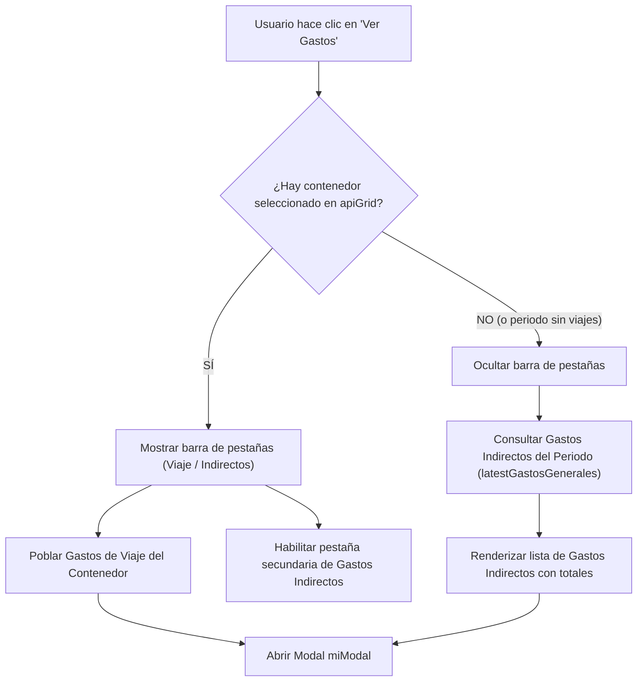

# Plan de Implementación — Spec 007

## 1. Arquitectura y Enfoque Técnico

El requerimiento resuelve una limitación en la interacción con el modal de gastos en `/reporteria/utilidad`.
En lugar de forzar una relación 1:1 estricta entre "Ver Gastos" y "Contenedor Seleccionado", el flujo se adapta dinámicamente al contexto:
1. **Contexto Contenedor Específico:** Se inspeccionan los gastos imputados directamente a ese viaje (`detalleGastos`).
2. **Contexto Periodo General (Sin Contenedor o Sin Viajes):** Se inspeccionan los gastos generales e indirectos de la empresa correspondientes a las fechas activas (`latestGastosGenerales`), los cuales ya son devueltos por el backend en `/reporteria/utilidad/ver-utilidad` (`ReporteriaService::getGastosGeneralesPeriodo`).

### Diagrama de Flujo Lógico

---

## 2. Cambios por Archivo

### `resources/views/reporteria/utilidad/index.blade.php`
- Modernización de la estructura HTML de `#miModal` con cabecera enriquecida, barra de pestañas `#gastosModalTabs`, contenedor scrollable para la lista `#infoGastos`, badge de total `#badgeTotalGastosModal` y pie con resumen de conteo.
- Estilos CSS actualizados: ancho de 580px, esquinas redondeadas (14px), sombras suaves y clases de soporte `.bg-success-transparent`.
- Configuración de `daterangepicker`: adición de `showDropdowns: true`, `linkedCalendars: false`, y rangos rápidos para Año Actual y Año Anterior.

### `public/js/sgt/reporteria/rpt-utilidades.js`
- `getUtilidadesViajes(startDate, endDate)`: retorna la promesa `$.ajax(...)` para soportar `await` y almacena `window.latestGastosGenerales = data.GastosGenerales || []`.
- `verDetalleGastos()`: evalúa si hay selección; si no hay, conmuta automáticamente a gastos indirectos sin disparar alertas de error.
- `cambiarTabGastos(tipo)`: conmuta estados de pestañas y llama a la función de renderizado correspondiente.
- `renderizarGastosContenedor()`: renderiza los gastos de viaje del contenedor seleccionado con subtítulo y total.
- `renderizarGastosIndirectos()`: renderiza los 8 gastos generales/indirectos mostrando concepto, fecha en español, badges de categoría, estatus y monto.
- `obtenerFechaFormateada(fecha)`: parsea fechas limpiando la zona horaria para evitar desfases de día.

---

## 3. Plan de Pruebas y Validación

1. **Prueba Sin Viajes (Caso Tera Junio 2026):**
   - Iniciar sesión con `tera@gmail.com`.
   - Seleccionar rango `2026-06-01` a `2026-06-30`.
   - Verificar que la grilla tenga 0 viajes.
   - Pulsar "Ver Gastos".
   - Validar que el modal se abra sin advertencias, listando los 8 gastos con total de **$76,913.30**.
2. **Prueba de Cierre del Modal:**
   - Cerrar mediante botón "De acuerdo", botón "x", o clic fuera del modal.
3. **Prueba de Selección Rápida de Fecha:**
   - Probar los selectores desplegables de mes y año sin navegación consecutiva forzada.
